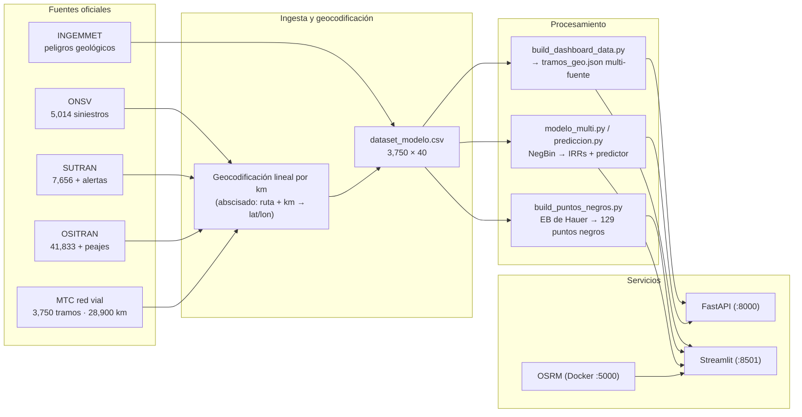
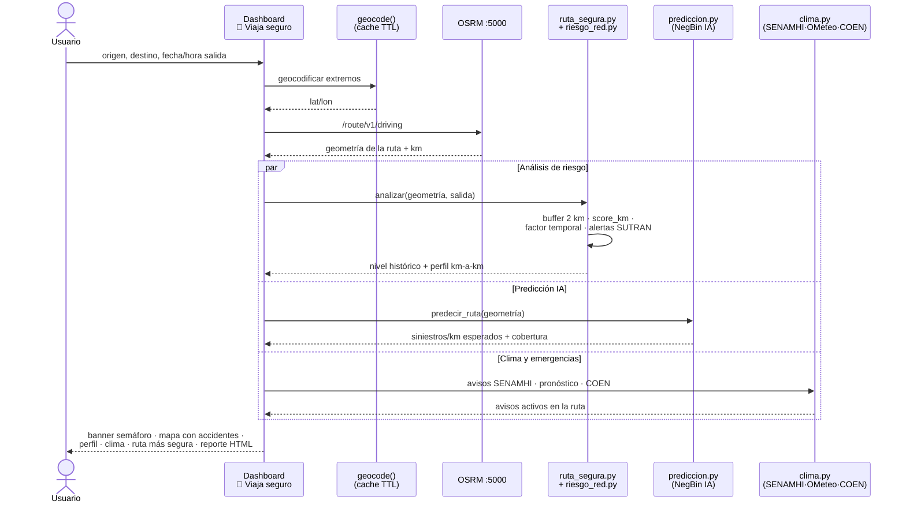
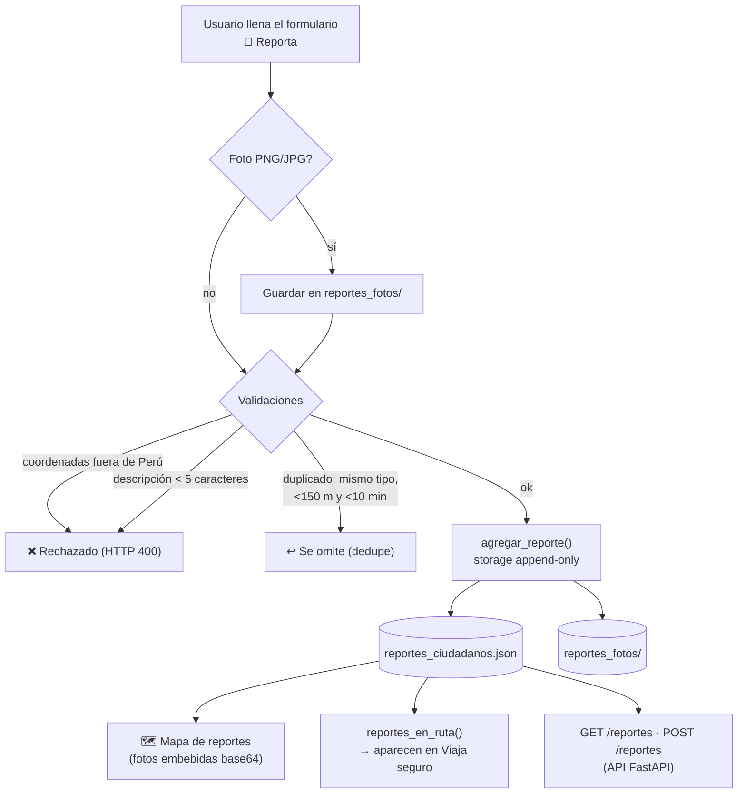
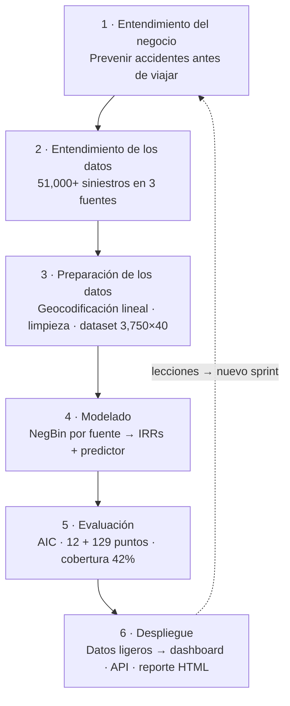
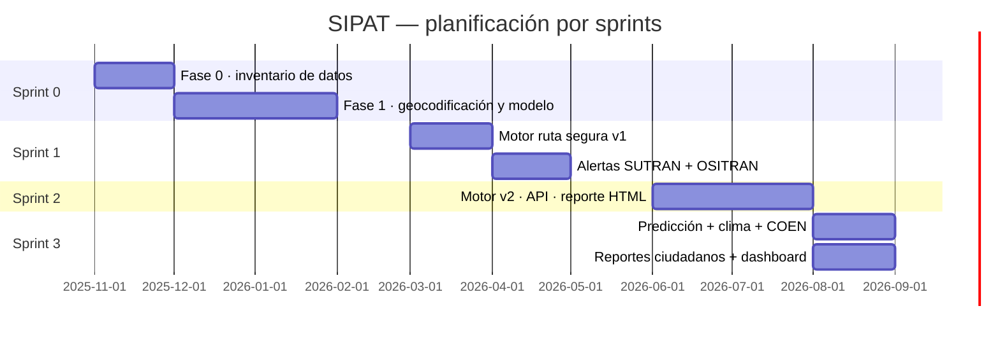

# 🛡️ SIPAT — Sistema de Prevención de Accidentes de Tránsito

**Analítica de siniestralidad vial y prevención antes de viajar para la Red Vial Nacional del Perú.**

SIPAT cruza más de **51,000 siniestros reales** de tres fuentes oficiales (ONSV, SUTRAN y OSITRAN)
con la red vial nacional georreferenciada, y convierte ese histórico en dos productos:

1. **🧭 Viaja seguro** — el usuario elige origen, destino y hora de salida, y *antes de partir*
   obtiene un mapa de su ruta con cada accidente ocurrido punto por punto, un índice de riesgo
   **histórico** y otro **predictivo (IA)**, el clima y los avisos meteorológicos de la ruta,
   las emergencias activas cercanas, las alertas de tránsito en vivo y un reporte HTML descargable.
2. **📣 Reporta** — cualquier ciudadano puede reportar accidentes, derrumbes, congestión u otros
   peligros con una **foto y contexto**, ubicándolos sobre su propia ruta; esos reportes aparecen
   en los mapas de los demás viajeros.

Complementa lo anterior con analítica nacional: mapa interactivo multi-fuente, puntos negros,
tendencias temporales, ranking de rutas críticas y un modelo estadístico Negative Binomial que
cuantifica qué factores elevan o reducen el riesgo.

---

## 1. Funcionalidades

### Dashboard (Streamlit · `http://localhost:8501`) — 7 pestañas

| Pestaña | Qué ofrece |
|---|---|
| **🧭 Viaja seguro** | Pills de rutas populares, cálculo de hasta 3 rutas alternativas (OSRM), cards KPI (distancia, riesgo histórico, riesgo previsto IA, ruta más segura, accidentes en la ruta), banner semáforo de riesgo, mapa full-width de la ruta con cada accidente clicable (fecha, tipo, causa, gravedad), perfil de riesgo km a km, sección "¿Qué puede pasar?", pronóstico Open-Meteo + avisos SENAMHI + emergencias COEN, alertas SUTRAN en vivo, reportes ciudadanos cercanos y reporte HTML descargable |
| **📣 Reporta un incidente** | Formulario ciudadano: tipo (accidente, congestión, obra, derrumbe, inundación, animal, vía interrumpida…), severidad Leve/Moderado/Grave, descripción, **foto opcional**, autor opcional; ubicación por deslizador de kilómetro sobre tu ruta calculada o por referencia geocodificada ("peaje Pucusana", "km 45 PE-1S"). Mapa nacional de reportes recientes con fotos embebidas en los popups |
| **🗺️ Mapa nacional** | Red vial coloreada por siniestros/km (amarillo→rojo) con capas toggleables: tramos, puntos negros y alertas históricas SUTRAN |
| **⚠️ Puntos negros** | Los 129 tramos con exceso de siniestros estadísticamente significativo, mapa + tabla descargable, fuente dominante por punto |
| **📈 Tendencias** | Series por año/mes/día/hora y gravedad (fallecidos por siniestro), separadas por fuente |
| **🏆 Rutas críticas** | Top 15 rutas y departamentos, tipos y causas más frecuentes |
| **📊 Modelo** | IRRs (Incidence Rate Ratios) del modelo NegBin por fuente con intervalos de confianza, y explorador de los 3,750 tramos |

### API REST (FastAPI · `http://localhost:8000`)

| Método | Endpoint | Descripción |
|---|---|---|
| GET | `/health` | Estado del servicio, puntos de riesgo cargados, alertas históricas |
| POST | `/ruta_segura` | Análisis completo de rutas entre origen y destino |
| POST | `/ruta_segura_completa` | Lo anterior + resumen de riesgo (histórico/predictivo) + clima + avisos |
| GET | `/alertas` | Alertas SUTRAN actuales (cache 15 min) |
| GET | `/avisos` | Avisos SENAMHI + emergencias COEN |
| GET | `/reportes` | Reportes ciudadanos de los últimos N días |
| POST | `/reportes` | Registrar un reporte ciudadano (validación Perú + dedupe) |

Ejemplo:

```bash
curl -X POST http://localhost:8000/ruta_segura_completa \
  -H "Content-Type: application/json" \
  -d '{"origin": "Lima", "dest": "Huancayo", "salida": "2026-08-22 08:00"}'
```

### Reporte HTML estático

`scripts/reporte_ruta.py` genera un reporte autocontenido (mapa, perfil de riesgo, clima,
tipos de incidente) desde cualquier resultado de análisis: `reporte_desde_resumen()`.

---

## 2. Fuentes de datos

| Fuente | Contenido | Volumen usado | Archivo procesado |
|---|---|---|---|
| **ONSV** (Observatorio Nacional de Seguridad Vial) | Siniestros fatales/lesionados 2021-2025 con clase, causa, hora, clima | 5,014 geocodificados | `data/processed/onsv_nacional_geocod.csv` |
| **SUTRAN** (Superintendencia de Transporte Terrestre) | Accidentes 2020-2021 + **alertas de tránsito en vivo** (interrumpido/restringido) | 7,656 registros · 4,116 en dashboard · alertas históricas acumuladas | `data/processed/sutran_accidentes_geocod.csv`, `dashboard/sutran_alertas_historico.json` |
| **OSITRAN** (Organismo Supervisor de Inversión en Infraestructura) | Accidentes en 16 concesiones viales 2019-2025 + flujo vehicular (AADT) por peaje | 41,833 accidentes · 55 peajes con tráfico · 71 tramos geocodificados | `data/processed/ositran_*.csv` |
| **MTC** (Ministerio de Transportes) | Red vial nacional segmentada por kilómetro | 3,750 tramos · ~28,900 km | `data/processed/tramos_red.csv` |
| **INGEMMET** | Peligros geológicos (para distancia a zonas de riesgo) | capa espacial | `features_distancia.csv` |
| **SENAMHI** (WFS oficial) | Avisos meteorológicos a 24 h (nivel, fecha, recomendación) | cache TTL | cache `clima/` |
| **Open-Meteo** | Pronóstico temperatura/lluvia/viento muestreado sobre la geometría de la ruta | cache TTL | cache `clima/` |
| **COEN-INDECI** | Emergencias activas (incendios, inundaciones, sismos) geocodificadas | últimos 7 días | cache `clima/` |
| **OpenStreetMap / OSRM** | Grafo vial para cálculo de rutas — servidor local en Docker | Perú completo | `data/osm/peru-latest.osm.pbf` |

> Todas las fuentes públicas. Los CSV crudos y procesados se versionan dentro de `data/`.

---

## 3. Cómo se manejan los datos (pipeline)



### Pasos clave

1. **Geocodificación lineal**: cada accidente llega con "ruta + kilómetro" (ej. PE-1S km 45).
   Se proyecta al polilíneo correspondiente de la red MTC usando el abscisado por km.
2. **Dataset espacial** (`dataset_modelo.csv`, 3,750 tramos × 40 variables): siniestros por fuente,
   fallecidos, topografía, superficie, velocidad proyectada, carriles, sinuosidad, distancia a
   peligros INGEMMET, peajes, etc.
3. **Unificación multi-fuente** (`build_dashboard_data.py` → `tramos_geo.json`): suma ONSV+SUTRAN+
   OSITRAN por tramo, distribuye accidentes OSITRAN (que vienen por tramo de concesión), añade
   alertas históricas SUTRAN y tráfico de peajes; exporta además los eventos por fuente como CSV
   ligeros para el dashboard.
4. **Puntos negros** (`build_puntos_negros.py`): ventana deslizante de 1 km + tres criterios —
   percentil 95 regional, exceso Empirical Bayes (método de Hauer) > 1.0 y residuos del modelo
   > 2.0 — con campo `fuente_dominante`.
5. **Modelo NegBin** (`modelo_multi.py` / `prediccion.py`): regresión binomial negativa por fuente
   (ONSV, SUTRAN, COMBINADO) con offset de exposición; produce IRRs con IC95% y un predictor que
   empalma cualquier geometría de ruta a los tramos (cKDTree) y devuelve siniestros esperados/km
   con % de cobertura de red.
6. **Índice de riesgo por km** (motor `riesgo_red.py`):

   ```
   score_km = (n_siniestros + 0.5·gravedad)/km
            + alertas_históricas_SUTRAN/km          # zonas recurrentes
            + Σ tráfico_peajes(≤15 km)               # min(AADT/100000, 0.5)
   score_final = score_km · factor_temporal(hora/día) + penalización_alertas_en_vivo
   ```

   Umbrales mostrados al usuario: **histórico** Bajo < 4 ≤ Medio ≤ 8 < Alto (score/km);
   **predictivo** Bajo < 0.5 ≤ Medio ≤ 1.2 < Alto (siniestros/km esperados).
   Factor temporal: sábado ×1.25, domingo ×1.1, noche 19-05h ×1.3, madrugada 05-08h ×1.05;
   alertas SUTRAN "INTERRUMPIDO" suman +5 y "RESTRINGIDO" +1 (±2 km).

### Datos en tiempo real y caches

- Alertas SUTRAN: descarga con TTL de 15 min; cada consulta alimenta el archivo acumulativo
  `sutran_alertas_historico.json` (señal de incidentes recurrentes).
- Clima/avisos/emergencias: cachés JSON con TTL (SENAMHI ~3 h, Open-Meteo ~2 h, COEN ~6 h);
  el botón "Actualizar ahora" fuerza refresco.
- Reportes ciudadanos: almacenamiento **append-only**
  (`data/processed/dashboard/reportes_ciudadanos.json` + fotos en `reportes_fotos/`),
  con validación de coordenadas dentro de Perú y deduplicación de 10 minutos.

### Flujo "Viaja seguro" (antes de salir)



### Flujo del reporte ciudadano



---

## 4. Arquitectura y diagramas interactivos

SIPAT sigue una **topología en estrella** centrada en la API FastAPI: el dashboard, el motor de
riesgo y los servicios externos no conversan entre sí, sino que todos pasan por el **nodo central**.
La API es el único punto que orquesta las capas de datos y expone endpoints a la interfaz.

```
            ┌────────────┐    Fuentes: ONSV · SUTRAN · OSITRAN · MTC · INGEMMET
            │  DATOS     │    tramos_geo.json (cKDTree) · ositran_*.csv · reportes
            └─────┬──────┘
                  │
┌──────────┐      │      ┌────────────────┐
│ OSRM     │      │      │  MOTOR RIESGO  │  riesgo_red.py · factor_temporal()
│ (Docker) │──────┼──────│  prediccion.py │  NegBin (puntual) · clima.py
└──────────┘      │      └────────────────┘
                  │
             ┌────┴───┐    ┌───────────────┐
             │  API   │────│  DASHBOARD    │  Streamlit · 7 pestañas
             └────────┘    └───────────────┘
```

**¿Por qué estrella?**
- **Límite de responsabilidades**: el dashboard solo consume payloads ya integrados; nunca
  geocodifica, modela ni consulta OSRM por su cuenta.
- **Un solo dueño del ranking**: que las 3 rutas, el score histórico y el predictivo salgan de un
  único endpoint evita versiones divergentes entre pestañas.
- **Cachés centralizadas** en la API (alertas SUTRAN, clima, avisos) con TTL y botón de refresco;
  el cacheo no se reparte entre procesos.
- **Gobernanza de datos**: todos los accesos a `tramos_geo.json`, peajes y reportes pasan por la
  API, de modo que validar (Perú + dedupe), auditar y testear (AppTest + 30 checks) es verificable
  en un solo front.

**Diagramas interactivos** (auto-contenidos, 1 fichero HTML cada uno; abren con cualquier navegador):

| Diagrama | Contenido | Ver en línea |
|---|---|---|
| **Arquitectura** | Topología estrella completa: API como hub, flujos con OSRM/OSITRAN/alertas | [sipat-architecture.html](https://htmlpreview.github.io/?https://github.com/Lobitoxxx/SIPAT/blob/main/docs/archify/sipat-architecture.html) |
| **Flujo de datos** | De las 3 fuentes geocodificadas al dataset 3,750×40 y a los servicios | [sipat-dataflow.html](https://htmlpreview.github.io/?https://github.com/Lobitoxxx/SIPAT/blob/main/docs/archify/sipat-dataflow.html) |
| **Secuencia "Viaja seguro"** | Solicitud → cálculo de riesgo (motor+IA+clima) → respuesta integrada | [sipat-sequence.html](https://htmlpreview.github.io/?https://github.com/Lobitoxxx/SIPAT/blob/main/docs/archify/sipat-sequence.html) |
| **Workflow del reporte ciudadano** | Formulario → validación+dedupe → almacén append-only → mapa | [sipat-workflow.html](https://htmlpreview.github.io/?https://github.com/Lobitoxxx/SIPAT/blob/main/docs/archify/sipat-workflow.html) |

> Los HTML viven en `docs/archify/` (preview del navegador sobre el repo) y también se guardan
> automáticamente en local dentro de la carpeta `docs/archify/` del proyecto.

---

## 5. Metodología de desarrollo: SCRUM + CRISP-DM

**SIPAT integra dos marcos complementarios**: CRISP-DM ordena el *ciclo de datos* (qué se hace con
los datos y cuándo) y SCRUM organiza la *entrega de producto* (quién hace qué y en qué sprints).

### CRISP-DM — ciclo de datos en 6 fases



Las **6 fases** aplicadas al proyecto:

| Fase CRISP-DM | Qué se hizo en SIPAT |
|---|---|
| **1. Negocio** | Productos: índice de riesgo por ruta + reporte ciudadano; usuarios: viajeros e instituciones |
| **2. Datos** | Inventario (Fase 0): 3 fuentes de siniestros + red vial MTC + peligros INGEMMET; calidad: geocodificación lineal (~14 m), cobertura SUTRAN 99.4% |
| **3. Preparación** | Limpieza (nulos, duplicados, rutas PE-XX), unificación multi-fuente por tramo, features espaciales (buffer 2 km, cKDTree), tráfico de peajes |
| **4. Modelado** | Negative Binomial por fuente con offset de exposición; predictor que empalma la ruta del usuario a los tramos |
| **5. Evaluación** | AIC NegBin 8,663 vs Poisson 11,984 (mezcla ONSV+SUTRAN); validación AppTest + 30 checks; comparación con umbrales de riesgo |
| **6. Despliegue** | Dashboard 7 pestañas, API REST, reporte HTML autocontenido, datos ligeros en `data/processed/dashboard/` |

### SCRUM — 3 sprints con entregas verificables



Cada sprint entregó un **incremento verificado**: batería de 30 comprobaciones, AppTest headless
del dashboard (7 pestañas + "Analizar mi ruta") y los diagramas Archify que documentan el sistema
en su estado final.

---

## 6. Estructura del proyecto

```
SIPAT/
├── api/app.py                  # API FastAPI (endpoints arriba)
├── dashboard/
│   ├── app.py                  # orquestador: datos, filtros, 7 tabs
│   ├── theme.py                # CSS moderno (Inter, gradiente, cards, pills)
│   ├── viaja_seguro.py         # pestaña principal (producto)
│   ├── reporta.py              # reportes ciudadanos con foto
│   ├── analitica.py            # mapa nacional, puntos negros, tendencias
│   └── modelo_tab.py           # rutas críticas y modelo NegBin
├── scripts/
│   ├── download_osm.py         # descarga OSM Perú
│   ├── osrm_build.py           # prepara grafo y sirve OSRM (--serve)
│   ├── osrm_router.py          # cliente OSRM local
│   ├── riesgo_red.py           # índice de riesgo espacial (cKDTree)
│   ├── ruta_segura.py          # motor: analizar(), mapa(), geocode()
│   ├── alertas_sutran.py       # alertas en vivo + histórico
│   ├── ositran_data.py         # ingesta/geocodificación OSITRAN
│   ├── clima.py                # SENAMHI WFS + Open-Meteo + COEN
│   ├── prediccion.py           # capa predictiva NegBin
│   ├── reportes_ciudadanos.py  # backend de reportes con foto
│   ├── reporte_ruta.py         # reporte HTML autocontenido
│   ├── build_dashboard_data.py # reconstruye tramos_geo.json multi-fuente
│   ├── build_puntos_negros.py  # detector de puntos negros
│   ├── modelo_multi.py         # NegBin multi-fuente (IRRs)
│   ├── boot_services.py        # arranca Docker+OSRM, API y Streamlit
│   ├── verificar_proyecto.py   # batería de 30 verificaciones
│   └── apptest_check.py        # AppTest del dashboard (7 tabs + calcular)
├── data/
│   ├── raw/                    # archivos originales descargados
│   ├── processed/              # datasets geocodificados y modelo
│   ├── processed/dashboard/    # assets ligeros del dashboard (JSON/CSV)
│   └── osm/                    # extracto PBF de Perú
├── docs/
│   ├── informe_sipat.md             # informe técnico, matriz técnica, manual, figuras
│   └── archify/                     # 4 diagramas interactivos (HTML autocontenidos)
└── graphify-out/               # grafo de conocimiento del código
```

---

## 7. Puesta en marcha

**Requisitos**: Windows/Linux, Python ≥ 3.10, Docker Desktop (para OSRM).
Dependencias principales: `streamlit folium plotly pandas numpy scipy statsmodels fastapi
uvicorn requests shapely`.

```bash
# 1. Preparar el grafo OSRM la primera vez (descarga + preprocesamiento, tarda)
python scripts/download_osm.py
python scripts/osrm_build.py

# 2. Arrancar todo (Docker OSRM :5000, API :8000, Dashboard :8501)
python scripts/boot_services.py

# 3. Abrir el sistema
#    http://localhost:8501  (dashboard)
#    http://localhost:8000/docs  (API interactiva)

# 4. Reconstruir datos del dashboard si cambian los datasets
python scripts/build_dashboard_data.py
python scripts/build_puntos_negros.py
python scripts/modelo_multi.py

# 5. Verificación completa (30 comprobaciones: assets, servicios, endpoints, AppTest)
python scripts/verificar_proyecto.py
```

---

## 8. Verificación y calidad

- `scripts/verificar_proyecto.py`: **30 checks** — presencia de datasets y documentos, servicios
  UP (OSRM/API/Streamlit), endpoints de API con respuesta válida, AppTest del dashboard
  (7 pestañas + botón "Analizar mi ruta" sin excepciones), exportaciones JSON/CSV y reportes HTML.
  Guarda el resultado en `data/processed/dashboard/verificacion.json`.
- `scripts/apptest_check.py`: prueba headless de UI con Streamlit AppTest.
- Validaciones del módulo de reportes: coordenadas dentro de Perú, descripción mínima,
  deduplicación temporal-espacial, tipos y severidades acotados.

---

## 9. Decisiones metodológicas y limitaciones

- **Tres fuentes, tres realidades**: ONSV registra siniestros fatales/por lesiones con calidad
  variable por departamento; SUTRAN cubre 2020-2021; OSITRAN cubre solo concesiones (sin
  coordenadas exactas, se asignan al centroide del tramo). El sistema nunca mezcla cifras como si
  fueran homogéneas: todo análisis permite separar por fuente.
- **El riesgo histórico no es una predicción**: es exposición pasada; por eso existe la segunda
  capa predictiva (NegBin) que ajusta por longitud, tráfico y características viales.
- **Clima y avisos dependen de servicios externos** (SENAMHI/Open-Meteo/COEN); ante fallo el
  dashboard muestra "no disponible" sin romper la experiencia.
- **Los reportes ciudadanos son autodeclarados**: sin moderación aún; sirven como señal
  complementaria y reciente, no como dato oficial.
- Cobertura predictiva típica ≈ 42% de la longitud de la ruta (tramos con features completas).

---

## 10. Documentación ampliada

- `docs/informe_sipat.md` — informe técnico completo (Fase 0/Fase 1).
- `docs/matriz_tecnica.md` — decisiones técnicas por componente.
- `docs/modulo_ruta_segura.md` — manual del motor de ruta segura.
- `docs/archify/*.html` — 4 diagramas interactivos (arquitectura, flujo de datos, secuencia y workflow).
- `graphify-out/GRAPH_REPORT.md` — arquitectura como grafo de conocimiento.

---

*Desarrollado como proyecto de analítica con Big Data sobre la Red Vial Nacional del Perú.*
