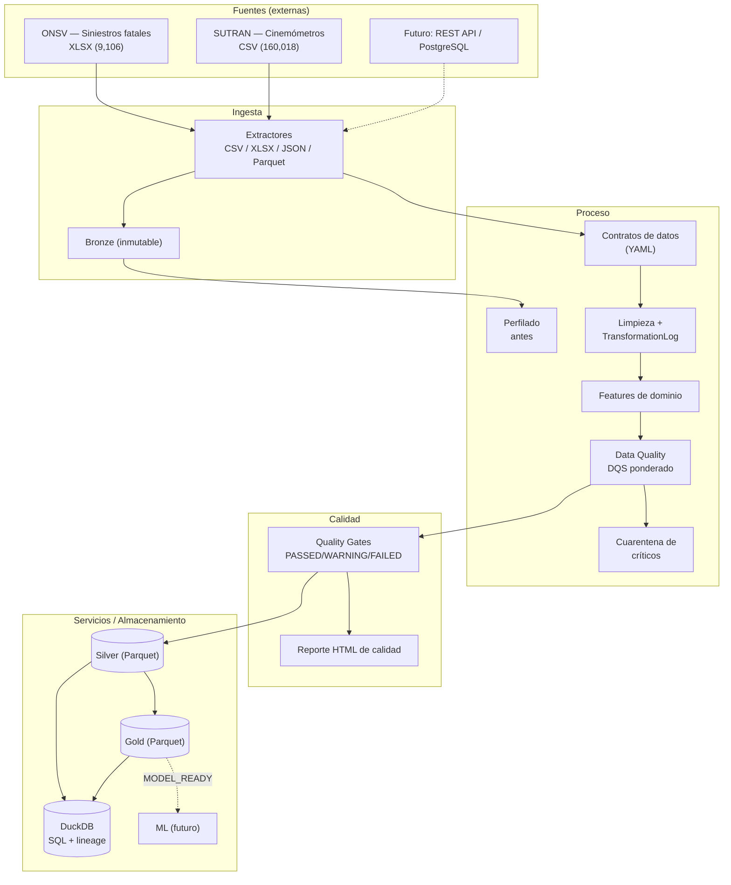
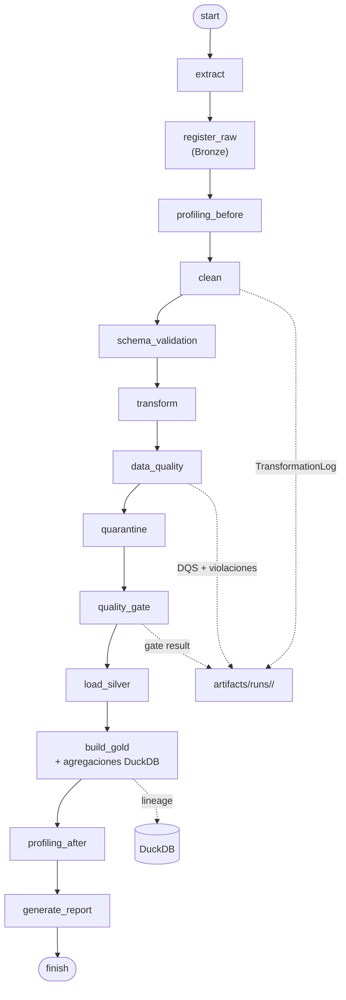
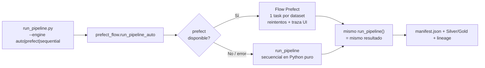
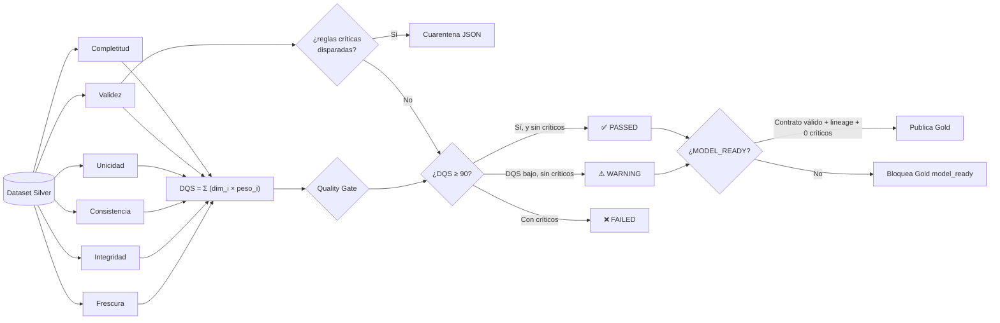
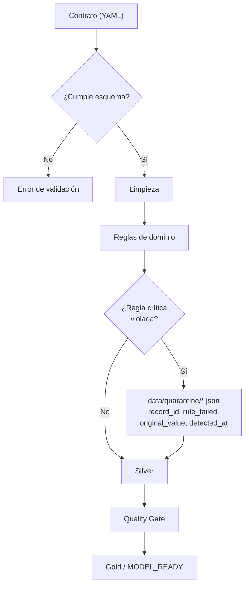
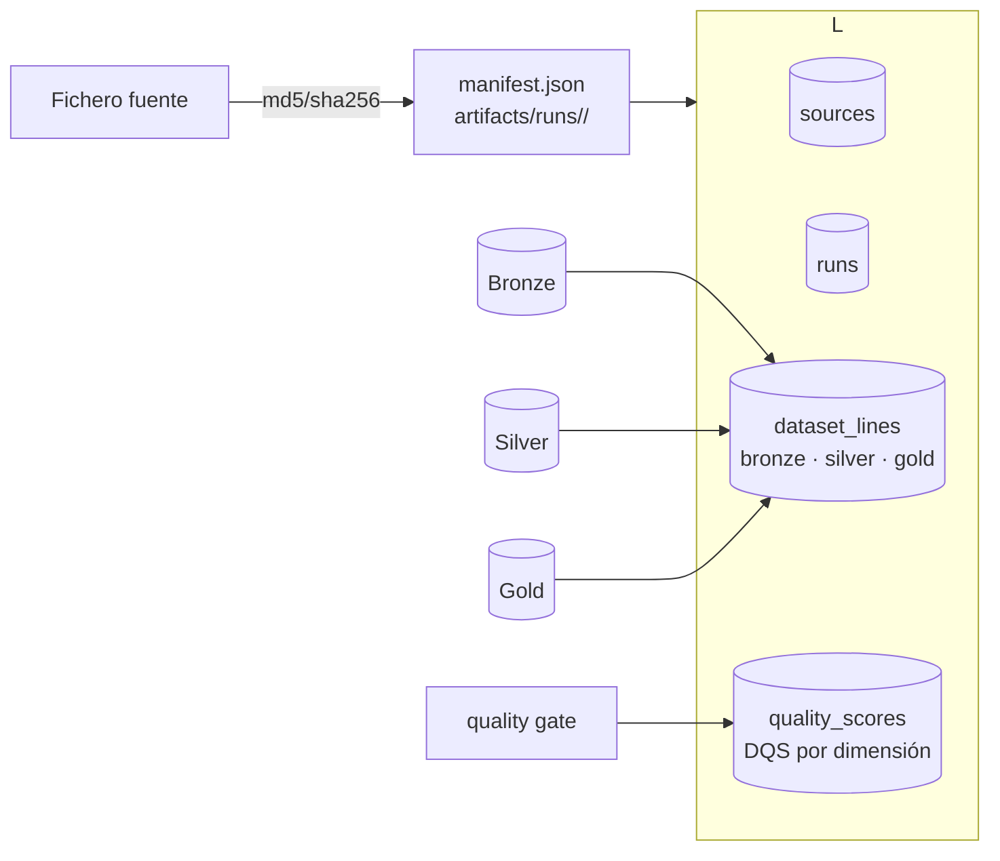
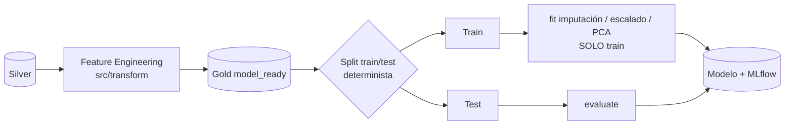
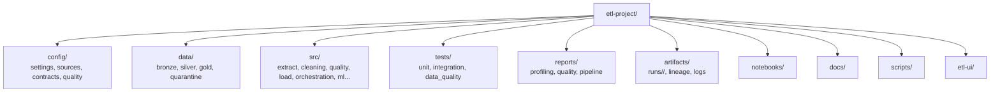
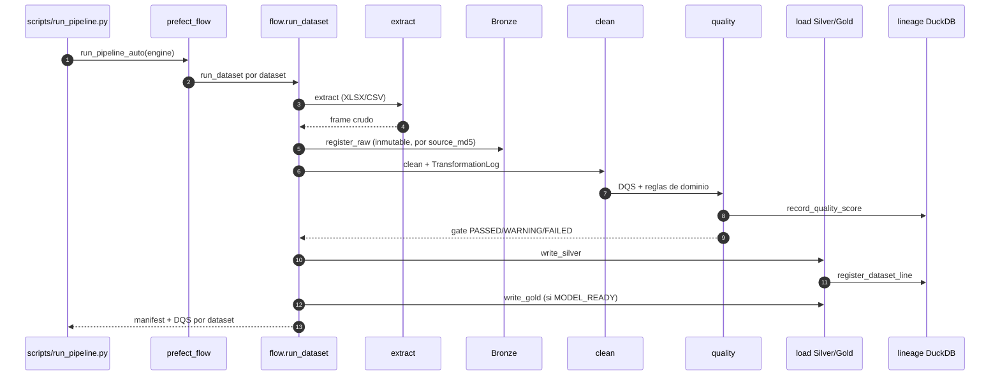

# SIPAT-ETL — Sistema Profesional de ETL, Calidad y Preparación de Datos

Proyecto ETL completo sobre **datos reales de siniestralidad vial del Perú** (fuentes del
workspace SIPAT), siguiendo **CRISP-DM + KDD** como metodología y **Kanban** para la gestión.
Cada requisito del enunciado está implementado, configurado y verificado por tests.

> **Principio rector:** los datos crudos nunca se borran ni se sobrescriben. Bronze es inmutable,
> cada transformación queda registrada y cada dataset publicado pasa un *quality gate* explícito.

---

## 1. Quick start

```bash
cd etl-project

# 1) Dependencias (Python 3.10+)
pip install -r requirements.txt

# 2) Ejecutar el pipeline completo (2 datasets reales)
python scripts/run_pipeline.py

# 3) Verificar la integridad del proyecto
python scripts/verify_etl.py

# 4) Tests
python -m pytest tests -q

# 5) (Opcional) Dashboard de observabilidad
streamlit run etl-ui/app.py
```

**Resultado real de la última corrida sobre datos reales:**

| Dataset | Bronze | Silver | DQS | Gate | Críticos | Cuarentena |
|---|---|---|---|---|---|---|
| `onsv` (siniestros fatales 2021-2025) | 9,106 × 27 | 9,106 × 33 | **92.07** | ✅ PASSED | 0 | 0 |
| `cinemometros` (velocidades SUTRAN 2019-2021) | 160,018 × 11 | 160,018 × 13 | **92.00** | ✅ PASSED | 0 | 0 |

`python scripts/run_pipeline.py --engine {auto|prefect|sequential}` — en `auto` usa Prefect 3 y
degrada a ejecución secuencial si el orquestador no está disponible.

---

## 2. Arquitectura general



---

## 3. Arquitectura Medallion (Bronze → Silver → Gold)

```mermaid
flowchart LR
  subgraph RAW["RAW (fuente original)"]
    direction TB
    R1["XLSX ONSV<br/>nombres con acentos, °, espacios dobles"]
    R2["CSV SUTRAN<br/>LIMA vs Lima, lat/lon duplicadas"]
  end

  subgraph B["BRONZE — inmutable, idempotente"]
    direction TB
    B1["onsv_1.0.parquet<br/>+ metadatos: source, run_id,<br/>md5, sha256, filas, cols"]
    B2["cinemometros_1.0.parquet<br/>+ metadatos"]
  end

  subgraph S["SILVER — limpio y canónico"]
    direction TB
    S1["onsv_silver_1.0.parquet<br/>nombres snake_case, fechas datetime,<br/>numéricos coercionados"]
    S2["cinemometros_silver_1.0.parquet<br/>regiones unificadas, sin duplicadas"]
  end

  subgraph G["GOLD — propósito específico"]
    direction TB
    G1["*_analytics_*.parquet"]
    G2["*_model_ready_*.parquet<br/>(solo si MODEL_READY)"]
    G3["*_agg_*.json (DuckDB)"]
  end

  RAW --> B
  B --> S
  S --> G
```



**Reglas de las capas**

| Capa | Contrato | Mutabilidad | Contenido |
|---|---|---|---|
| **Bronze** | dato tal cual llega + metadatos | inmutable | copia del fichero fuente, checksum, run_id, fecha de ingesta |
| **Silver** | contrato YAML (`config/contracts/`) | regenerable | nombres canónicos, tipos correctos, dedupe, imputación, fechas parseadas |
| **Gold** | propósito concreto | derivado | analítico, `model_ready` (gated), agregados SQL |

---

## 4. Pipeline de 15 etapas



Cada etapa: registra `status` (OK/ERROR), payload saneado, traza de excepción y log
estructurado (`timestamp | level | module | run_id | dataset | operation`).

### Orquestación: Prefect 3 con fallback secuencial



Ambas rutas ejecutan exactamente la misma función `run_pipeline()`; Prefect solo añade
reintentos, caché y observabilidad. Si Prefect no está instalado o su backend no arranca,
el pipeline **no se detiene**: degrada a secuencial y lo deja registrado en el log.

---

## 5. Data Quality: DQS ponderado y quality gates



- **DQS** = Σ (dimensión × peso). Pesos configurables en `config/settings.yaml`
  (completitud .22, validez .22, unicidad .15, consistencia .15, integridad .18, frescura .08).
- **DQS NO es una probabilidad** de que los datos sean "verdaderos": es un indicador interno
  de calidad del dataset para la organización.
- **Gates**: `min_quality_score: 90`; reglas críticas (pk, contrato, coordenadas, target)
  exigen 100 % de cumplimiento; cualquier crítico ⇒ FAILED + cuarentena.

### Cadena de calidad y cuarentena



### Lineage y trazabilidad



- **Agregaciones Gold**: cada dataset declara sus consultas SQL en
  `config/quality/catalogs/<dataset>.yaml` (`aggregations:` con `count_by` / `sum_by` / `mean_by`).
  Se ejecutan sobre DuckDB y se publican en `reports/quality/aggregations/`. No hay SQL hardcodeado.
- **Idempotencia real**: la comparación de Bronze se hace contra el `source_md5` registrado en el
  `.meta.json`, no contra el md5 del parquet. Si la fuente cambia, el Bronze previo se archiva con
  sufijo `_superseded_<timestamp>` (no se borra nada) y se registra el nuevo.

---

## 6. Preparación ML sin fugas



`is_model_ready()` (sección MODEL_READY) exige simultáneamente: contrato válido, gate PASSED,
lineage disponible, 0 errores críticos, DQS ≥ umbral y versión registrada. Si algo falla,
**no se publica** `model_ready` y se documenta el bloqueo.

---

## 7. Estructura del proyecto



```
etl-project/
├── config/
│   ├── settings.yaml              # rutas, pesos DQS, planes de limpieza, renombres
│   ├── sources/                   # definición de cada fuente (tipo, header_row, encoding)
│   ├── contracts/                 # contratos de datos por dataset
│   └── quality/                   # reglas, pesos y catálogos de dominio
├── data/
│   ├── bronze/  silver/  gold/    # capas Medallion (Parquet)
│   └── quarantine/                # registros rechazados por reglas críticas
├── src/
│   ├── utils/                     # rutas, config, hashing, logging, versioning
│   ├── extract/                   # base + CSV/XLSX/JSON/Parquet + factory + Bronze
│   ├── profiling/                 # perfilado antes/después (JSON/CSV/HTML)
│   ├── validation/                # validación de contrato
│   ├── cleaning/                  # limpieza configurable + TransformationLog
│   ├── transform/                 # features de dominio
│   ├── quality/                   # DQS, reglas, gates, cuarentena, MODEL_READY
│   ├── load/                      # escritores Silver/Gold
│   ├── sql_engine/                # DuckDB + lineage
│   ├── lineage/                   # registro de trazabilidad
│   ├── orchestration/             # flujo de 15 etapas
│   ├── reports/                   # reporte HTML de calidad
│   └── ml/                        # preparación (sin fugas) + esqueleto MLflow
├── tests/                         # 87 tests (unit / integration / data_quality)
├── scripts/                       # run_pipeline, verify_etl, duckdb_shell
├── notebooks/                     # exploración de datos reales
├── docs/                          # informes y guías
├── etl-ui/                        # dashboard Streamlit (solo lectura)
├── reports/                       # perfiles y reportes generados
├── artifacts/runs/<run_id>/       # manifest.json + transform_log_<dataset>.json
└── etl-ui, VERSION, requirements.txt, pyproject.toml, .env.example
```

---

## 8. Configuración: nada hardcodeado

Toda la lógica de negocio vive en YAML; el código la lee.

| Fichero | Contenido |
|---|---|
| `config/settings.yaml` | rutas (`${sipat_root}`), pesos del DQS, `numeric_strip_chars`, planes de imputación, renombres canónicos, columnas a descartar, dedupe |
| `config/sources/*.yaml` | tipo de fuente, ruta, `header_row` (el XLSX de ONSV tiene preámbulo: cabecera en fila 5), `encoding` |
| `config/contracts/*.yaml` | columnas canónicas: tipo, nulabilidad, unicidad, rangos, patrones, valores permitidos |
| `config/quality/quality_rules.yaml` | pesos de gates, `min_quality_score`, reglas críticas y warnings por dataset |
| `config/quality/catalogs/*.yaml` | catálogos de dominio (departamentos, clases, causas, carreteras…) derivados del análisis de los datos reales |

---

## 9. Problemas reales encontrados en los datos (y su solución configurable)

| Hallazgo en el dato real | Solución implementada |
|---|---|
| XLSX ONSV con 4 filas de preámbulo antes de la cabecera | `header_row: 4` en `config/sources/onsv_xlsx.yaml` |
| Nombres de columna con acentos, `¿?` y espacios dobles (`'COORDENADAS  LONGITUD'`) | `rename` canónico en `settings.yaml` |
| Fechas `DD/MM/YYYY` (pandas interpreta como `MM/DD` → 5,463 `NaT`) | `date_columns` con formatos explícitos por dataset |
| Coordenadas con símbolo grado (`-71.3253°`) | `numeric_strip_chars: ["°","º",","," "]` antes de coerción numérica |
| `REGION` con `LIMA` y `Lima` (doble caja) | `case_normalize` + `fold_accents` en categorías |
| `lat`/`lon` duplican exactamente `LATITUD`/`LONGITUD` | `drop_columns: ["lat","lon"]` |
| `CANTIDAD DE VEHICULOS DAÑADOS` con 2,813 nulos | imputación `median` registrada en TransformationLog |
| Columnas `object` que mezclan tipos (`FECHA SINIESTRO`: datetime + `'01/01/2021'`; `COORDENADAS LONGITUD`: float + `'-71.3253°'`), no escribibles en Parquet | `_parquet_safe()` normaliza por contenido en Bronze (numérico → fecha → literal), sin pérdida de valores |
| Acentos en catálogos/contratos que la limpieza elimina (`CAÍDA`→`CAIDA`, `VENTARRÓN`→`VENTARRON`) | catálogos y contratos escritos en forma plegada; comparación normalizada (`_norm`) |
| Valores de imputación de dominio (`DESCONOCIDO`) no presentes en el catálogo | declarados explícitamente en el catálogo; no cuentan como outlier |
| Coordenadas de Perú negativas: un chequeo de validez `>= 0` las penalizaba como 0 % | `validity` usa el rango declarado en el contrato (lat −18.5..0.2, lon −81.5..−68.5) |
| `freshness_column` no estaba en el contrato, así que la frescura se fijaba en 100 | se lee de `settings.datasets.<dataset>.freshness_column` |

---

## 10. Trazabilidad y observabilidad

- **run_id** único por ejecución: `run-YYYYMMDD-HHMMSS-<uuid8>`.
- **Bronze metadata**: fuente, `run_id`, dataset version, MD5/SHA256, tamaño, filas, columnas, timestamp de ingesta.
- **TransformationLog** por dataset: operación, columna, registros afectados, ejemplos antes/después, estrategia.
- **manifest.json** por run: estado, resultado de cada una de las 15 etapas, DQS por dataset.
- **Lineage en DuckDB**: tablas `sources`, `runs`, `dataset_lines` y `quality_scores`, con índices
  únicos que hacen el registro idempotente.
- **Logging estructurado** en JSON (consola + `artifacts/logs/etl.log` rotatorio).
- **Idempotencia**: reejecutar con la misma fuente no duplica filas, no reescribe Bronze y no altera el DQS.



---

## 11. Testing

```bash
python -m pytest tests -q          # 87 tests
```

| Suite | Cobertura |
|---|---|
| `tests/unit/test_core.py` (33) | extractores, contratos, limpieza, TransformationLog, features, DQS, reglas, gates, cuarentena, MODEL_READY, silver, hashing, run_id |
| `tests/unit/test_regressions.py` (28) | regresiones de defectos reales: columnas `object` mixtas en Bronze, coordenadas negativas en `validity`, `freshness_column`, folding de acentos en catálogos, comparación tz-naive, reglas nuevas del validador, agregaciones configurables, split ML |
| `tests/unit/test_smoke.py` (4) | importación de todos los módulos, extracción XLSX con preámbulo, corrida mini end-to-end |
| `tests/integration` (9) | pipeline completo (15 etapas), manifest, silver/gold/reporte, idempotencia, lineage DuckDB, agregaciones SQL |
| `tests/data_quality` (13) | contrato y reglas críticas sobre los **datos reales** (se saltan si la fuente no está) |

`tests/unit/test_regressions.py` existe porque durante la validación sobre datos reales se
detectaron defectos que no fallaban en los tests con fixtures sintéticas (por ejemplo, las
coordenadas negativas del Perú puntuaban 0 % en validez porque se asumía `>= 0`). Cada test de
ese fichero documenta el fallo original.

---

## 12. Documentación y notebooks

### Notebooks de exploración (`notebooks/`)

Ejecutan sin errores contra los datos reales (verificado con `nbclient`):

| Notebook | Foco | Responde a |
|---|---|---|
| `01_exploracion_onsv.ipynb` | crudo XLSX | ¿dónde está la cabecera? ¿qué columnas mezclan tipos y por qué no son escribibles en Parquet? ¿qué pasa con acentos, fechas DD/MM y coordenadas negativas? |
| `02_exploracion_cinemometros.ipynb` | crudo CSV de 160k filas | ¿cuántas filas sufre la doble caja en `REGION`? ¿`lat`/`lon` duplican exactamente? ¿cuál es la distribución del exceso de velocidad? |
| `03_silver_dqs_gate.ipynb` | Silver + calidad | ¿qué limpió exactamente el pipeline? ¿cómo se descompone el DQS? **¿qué pasa si inyecto una violación crítica?** |

Se regeneran con `python scripts/build_notebooks.py`, que valida la sintaxis de cada celda
antes de escribir el `.ipynb` (un error solo aparecería al abrir el notebook, que es cuando
más molesta).

### Documentación

| Documento | Contenido |
|---|---|
| `LEEME.txt` | guía rápida de instalación y ejecución |
| `docs/informe_etl_v1.md` | informe técnico: metodología, hallazgos, **defectos del propio sistema**, resultados DQS, limitaciones |
| `docs/guia_sustentacion.md` | guía de sustentación: qué preguntar y qué responder |
| `docs/preguntas_tecnicas.md` | 12 preguntas técnicas con respuesta y referencia a código |
| `docs/airflow_migracion.md` | DAG equivalente en AirFlow y tabla de correspondencia |
| `docs/dvc_versionado.md` | versionado de datos con DVC |
| `docs/mlflow_modelado.md` | fase de modelado, reglas anti-fuga y registro en MLflow |

---

## 13. Metodología aplicada

- **CRISP-DM** (fases): *Entender datos* (perfilado + contratos) → *Preparar* (limpieza, cuarentena, features) → *Modelar* (se prepara `model_ready` y `src/ml`, sin fugas) → *Evaluar* (DQS, gates, MODEL_READY). Enfoque **KDD** con tensores y knowledge base de reglas de dominio.
- **Kanban**: tableroimplícito por etapas del pipeline; cada cambio de dataset pasa por `clean → transform → data_quality → gate → publish`.

---

## 14. Licencia y créditos

Proyecto académico. Datos de fuentes públicas: **ONSV** (Observatorio Nacional de Seguridad Vial) y
**SUTRAN/MTC** (Superintendencia de Transporte Terreno de Carreteras). La capa ETL reutiliza el
workspace SIPAT como fuente de datos reales.
