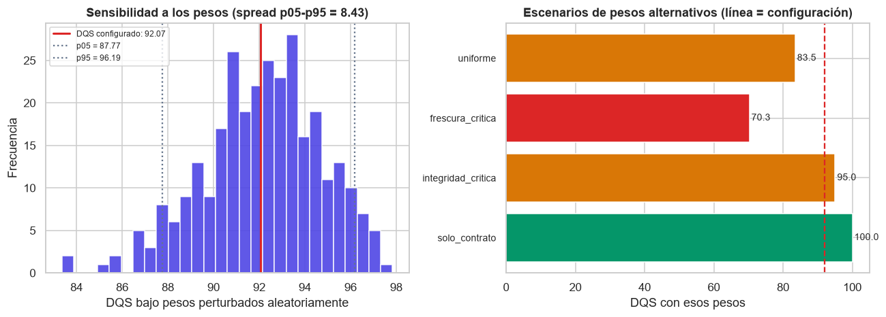

# Confiabilidad de las métricas — SIPAT-ETL

> **Este apartado no es sobre la calidad del dato, sino sobre la confianza en las métricas.**
> Son dos preguntas distintas y confundirlas es el error más común al presentar un ETL.

- **DQS** (`src/quality/dimensions.py`): ¿tiene nulos?, ¿los valores están en rango?, ¿la clave es única?
  → Mide **propiedades del dato**.
- **Confiabilidad** (`src/quality/reliability.py`): ¿ese DQS de 92.07 es un hecho o el
  resultado de decisiones mías?, ¿cuánta incertidumbre tiene?, ¿qué parte de la validación
  es tautológica?
  → Mide **la confianza en la medición**.

Todo lo de aquí se **calcula**, no se escribe a mano:

```bash
python scripts/graficos_etl.py       # recalcula, dibuja y genera el informe HTML
```

Salidas: `reports/reliability/<dataset>_reliability_<ts>.json` (datos crudos),
`reports/reliability/<dataset>_confiabilidad_<ts>.html` (informe autocontenido con figuras
embebidas) y `docs/figuras/etl/*.png` (18 figuras).

---

## 1. Por qué NO hay un "índice de confiabilidad"

Podría haberse calculado un `índice de confiabilidad = 87/100`. **No se ha hecho, a propósito.**

Un número compacto que resume "confiabilidad" invita a leerlo como *probabilidad de que los
datos sean ciertos*, que es exactamente el malentendido que ya produce el DQS. Un veredicto
alto sin su límite se lee como una garantía, y aquí no hay garantías.

En su lugar, este apartado es una **tabla de afirmaciones verificables**: cada fila dice si se
sostiene o no, con la evidencia medida y el límite que la acota.

| Veredicto | Significado |
|---|---|
| **alta** | Verificado con evidencia interna repetible y sin contraejemplo conocido. |
| **media** | Verificado, pero con una condição que lo acota. |
| **baja** | Se sostiene poco: la propia medición tiene un defecto conocido. |
| **no_verificable** | No se puede comprobar con los datos disponibles aquí. |

---

## 2. Tabla de afirmaciones — ONSV (DQS 92.07)

Resultado sobre datos reales, corrida `run-20260929-173626-41cd6f51`:

| Id | Eje | Veredicto | Evidencia medida | Límite conocido |
|---|---|---|---|---|
| **A1** | Reproducibilidad | 🟢 **alta** | 3 corridas con la misma huella de medición → DQS idéntico (rango 0.00) | Se comprobó con el mismo fichero fuente; no con una fuente que cambie |
| **A2** | Trazabilidad | 🟢 **alta** | manifest por corrida, lineage DuckDB (4 tablas), `source_md5`, Bronze inmutable, TransformationLog | Acredita de dónde sale el dato, no que la fuente original sea correcta |
| **A2b** | Robustez del DQS | 🟡 **media** | spread p05–p95 = **8.43** puntos con 300 perturbaciones de pesos | Mide sensibilidad a los **pesos**, no a los datos: un DQS robusto a los pesos puede seguir siendo irreal si el dataset tiene sesgo |
| **A3** | Incertidumbre | 🟢 **alta** | DQS 92.07, IC 95 % = [92.06, 92.09], amplitud **0.03** puntos | El bootstrap mide variabilidad **muestral**; no cubre el sesgo de la fuente |
| **A4** | Circularidad | 🔴 **baja** | **100 %** de los catálogos derivan del propio dataset | Validar contra un catálogo hecho con esos mismos datos es consistencia interna, no validación externa. Un valor erróneo de la fuente entra en el catálogo y se autovalida |
| **A5** | Cobertura del universo | ⚪ **no verificable** | 2021-01-01 → 2025-12-30; 9,106 registros; 54.6 % en 2021 | La completitud mide nulos, **no** si la fuente publicó todos los siniestros. Falta el total oficial ONSV/MTC |
| **A6** | Integridad referencial | ⚪ **no verificable** | dimensión `integrity` = 100.0, FK configuradas = 0 | Está fijada a 100 porque no hay claves foráneas. **No debe leerse como "integridad perfecta"**: es una dimensión vacía |
| **A7** | Consistencia cruzada | 🔴 **baja** | Jaccard ONSV↔cinemómetros = **0.40**; 15 departamentos de ONSV ausentes en cinemómetros | Sin maestro UBIGEO no se puede arbitrar cuál tiene razón: se **declara**, no se corrige |
| **A8** | Imputación | 🟡 **media** | `vehiculos_danados` imputado con mediana (30.9 % nulos) | Las métricas de esa columna son **estimaciones**, no mediciones. Deben declararse al usarlas |
| **A9** | Deriva temporal | 🟢 **alta** | 3 corridas del código vigente → sin variación | Trivialmente correcto: todas parten del mismo fichero fuente. Solo será información real cuando la fuente se actualice |

**Resumen: 4 alta · 2 media · 2 baja · 2 no verificable.**

Cinemómetros (DQS 92.00) tiene el mismo perfil: 4 alta · 1 media · 2 baja · 2 no verificable.

---

## 3. Lo que SÍ se puede sostener

1. **El pipeline es determinista.** Tres corridas con la misma huella de medición producen DQS
   idéntico. No es determinismo declarado: es medido.
   → `docs/figuras/etl/dqs_evolucion_onsv.png`

2. **Cada número es trazable hasta el fichero original**, pasando por el checksum de la fuente
   y un Bronze inmutable.

3. **El DQS es un estimador muy preciso.** IC 95 % de 0.03 puntos: con otra muestra de las
   mismas 9.106 filas, el DQS no se movería apreciablemente.
   → `docs/figuras/etl/onsv_dqs_ic_bootstrap.png`

4. **La limpieza funciona, y se ve.** La figura de nulos antes/después es la prueba visual.
   → `docs/figuras/etl/onsv_nulos_antes_despues.png`

## 4. Lo que NO se puede sostener

### 4.1 La circularidad de los catálogos (el límite más serio)

`config/quality/catalogs/onsv.yaml` se derivó de los valores **observados en el propio dataset**.
Después, el pipeline valida el dataset contra ese catálogo y obtiene **100 % de validez**.

Eso no demuestra que los datos sean correctos: demuestra que son **consistentes consigo mismos**.
Un valor mal escrito en la fuente entraría en el catálogo y se aprobaría a sí mismo.

La única forma de cerrar este eje es contrastar con una fuente externa (catálogo oficial de
INEI, MTC o el maestro UBIGEO delINEI), que no está en este workspace. Por eso el veredicto
es **baja** y no "alta": **declaramos la limitación en vez de esconderla**.

> Es exactamente el patrón que produjo el defecto D1 (coordenadas del Perú puntuadas 0 %):
> un indicador que nunca falla porque se valida a sí mismo.

### 4.2 El DQS depende de los pesos que elegí



| Escenario de pesos | DQS resultante |
|---|---|
| Configuración actual | **92.07** |
| Uniforme (las 6 dimensiones iguales) | 83.48 |
| Frescura crítica (0.30) | **70.26** |
| Integridad crítica (0.30) | 95.04 |
| Solo contrato (frescura = 0) | **100.00** |

El mismo dataset, los mismos datos y el mismo código dan desde **70.26 hasta 100.00** según
cómo se repartan los pesos. El número 92.07 refleja **una decisión de configuración**, no solo
una propiedad del dato.

Por eso A2b es "media" y no "alta". Ningún DQS ponderado puede ser más preciso que sus pesos.

### 4.3 La cobertura del universo es la incógnita más grande

El dataset tiene 9.106 siniestros con **cero nulos en las columnas obligatorias** (100 % de
completitud). Eso no dice si la ONSV publicó el 60 % o el 100 % de los siniestros de 2021-2025.

Sin el total oficial, cualquier afirmación sobre "la siniestralidad en el Perú" basada en este
dataset es una afirmación sobre **el dataset**, no sobre el país. Es el límite más relevante
para quien use estos números.

### 4.4 Una dimensión vacía

`integrity` vale 100.00 siempre. No es una buena señal: es una dimensión que **no mide nada**
porque no hay claves foráneas entre datasets. Aparece en verde en los gráficos y eso es
engañoso; por eso tiene su propia afirmación (A6) con veredicto "no verificable".

### 4.5 Hallazgo visual: columnas que la limpieza no puede arreglar

La figura de nulos muestra 4 columnas de ONSV que siguen **~90 % vacías** en Silver
(`clasif_senal_vert_1`, `clasif_senal_vert_2`, `existe_senal_vertical`,
`existe_senal_horizontal`). No es un fallo del `fillna`: la fuente simplemente no trae esos
datos. El umbral `drop_columns_with_missing_pct_ge: 0.99` no las descarta porque están por
debajo del 99 %.

**Conclusión:** esas cuatro variables no deben usarse en un modelo. El pipeline las conserva
porque borrar columnas es una decisión analítica, no de limpieza.

---

## 5. Cómo se midió (reproducibilidad de este apartado)

| Eje | Método | Parámetros (en `config/quality/reliability_rules.yaml`) |
|---|---|---|
| Sensibilidad a pesos | 300 perturbaciones Dirichlet alrededor de los pesos base + 4 escenarios declarados | `weight_sensitivity.n_samples: 300`, `seed: 42` |
| Incertidumbre | Bootstrap con reemplazo, 300 remuestreos, IC 95 % | `bootstrap.n_resamples: 300`, `ci: 0.95` |
| Circularidad | % de valores de cada catálogo presentes en el propio dato | `catalog_circularity.circular_threshold_pct: 80` |
| Cobertura | Rango temporal, años presentes y vacíos, concentración | `coverage.date_column: auto` |
| Consistencia cruzada | Índice de Jaccard entre claves geográficas de dos datasets | `cross_dataset.compare` (con `key_a`/`key_b`) |
| Deriva | DQS por corrida, agrupado por **huella de medición** | `drift.tolerance_dqs: 0.5` |

Nada está hardcodeado: cambiar un umbral es editar el YAML.

---

## 6. Tres decisiones metodológicas que hubo que tomar (y por qué)

### 6.1 La huella de medición, no el commit de Git

Para detectar deriva hay que comparar corridas hechas **con el mismo método**. Lo natural sería
agrupar por `git_commit`, pero tras integrar `etl-project/` en el repositorio SIPAT, el commit
del padre cambia por motivos ajenos (editar un README) y produciría falsos positivos.

Se implementó `versioning.measurement_fingerprint()`: un hash de los ficheros que **producen**
las métricas (`config/settings.yaml`, contratos, catálogos, `dimensions.py`, `domain_rules.py`,
`gates.py`, `model_ready.py`, `validation/contract.py`, `cleaning/clean.py`).

Decisión deliberada: **`reliability.py` NO está en esa lista**. El auditor no produce la
medición; si estuviera, tocar el auditor invalidaría la comparabilidad de las corridas, que es
justo lo que la huella debe evitar.

Además, la huella *vigente* es la del **código actual**, no la más numerosa: si se eligiera la
más frecuente, el veredicto de reproducibilidad se calcularía sobre corridas antiguas con una
medición ya corregida. (Ese bug dio un "baja" injusto y está cubierto por un test de regresión.)

### 6.2 El bootstrap y la trampa del remuestreo con reemplazo

Remuestrear filas **con reemplazo** duplica las claves primarias, así que la dimensión
*unicidad* se hunde por un artefacto del remuestreo, no por el dataset.

La primera implementación daba **punto 92.07 contra IC [86.45, 86.65]**: un IC que no contiene
a su propio estimador puntual, la señal clásica de un bootstrap sesgado. Habría publicado una
"incertidumbre" falsa.

Solución declarada en la config (`bootstrap.fix_dimensions: [uniqueness, integrity]`): las
dimensiones que no dependen del muestreo de filas se mantienen en su valor observado. Resultado:
IC [92.06, 92.09]. También hay un test de regresión que falla con el código anterior.

### 6.3 Cambio de método ≠ deriva

El DQS de ONSV pasó de 94.97 a 92.07 durante el desarrollo. Eso **no** es inestabilidad: fue
la corrección del defecto de las coordenadas negativas. Mezclar ambos casos daría un veredicto
injustamente malo.

`run_drift` separa por eso `deriva_por_huella` (dentro del mismo método: instability real) de
`cambios_entre_huellas` (cambio de método: corrección).

---

## 7. Cómo presentarlo en una sustentación

**No digas:** *"nuestro pipeline tiene 92 % de confiabilidad"*. No existe ese número.

**Di:** *"El DQS de nuestro dataset es 92.07, con un intervalo de confianza de 0.03 puntos:
es un estimador muy estable. Es determinista y trazable. Pero somos conscientes de tres
límites: la validación de catálogos es circular porque los derivamos del propio dato, el
score depende de los pesos que elegimos —va del 70 al 100 según el escenario— y no podemos
verificar la cobertura del universo sin el total oficial de la ONSV."*

Ese segundo párrafo es el que distingue un trabajo sólido de uno que solo vende su número.

---

## 8. Documentos relacionados

- `docs/informe_etl_v1.md` — informe técnico; sección 6 con los 10 defectos del propio sistema
- `docs/guia_sustentacion.md` — guía de preguntas y respuestas
- `docs/figuras/etl/` — las 18 figuras
- `reports/reliability/*.html` — informe autocontenido por dataset
- `config/quality/reliability_rules.yaml` — umbrales y parámetros
- `src/quality/reliability.py` — el motor (8 ejes)
- `tests/unit/test_reliability.py` — 34 tests
