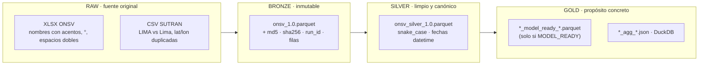
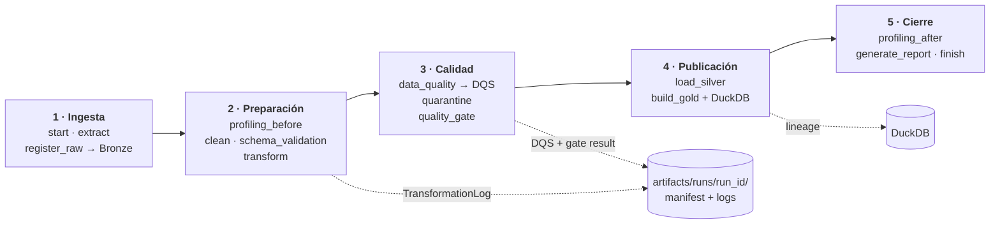
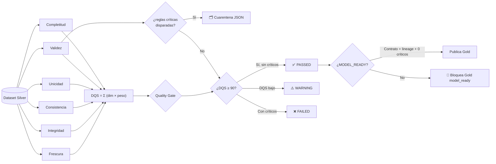
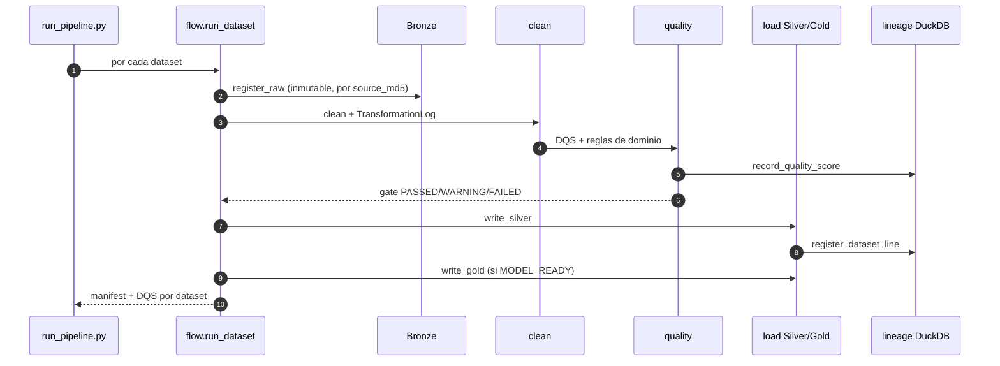

  
Bloque 02 · SIPAT-ETL esencial

  <h2>Antes de analizar, hay que <i>verificar</i></h2>
  

    Subproyecto con su propio repositorio Git. Principio rector: <b>los datos crudos nunca se borran ni se sobrescriben</b>.
    Bronze es inmutable, cada transformación queda registrada y cada dataset publicado pasa un <b>quality gate</b> explícito.
  

  02

---

  

    SIPAT-ETL esencial
    <h1>Arquitectura Medallion: RAW → Bronze → Silver → Gold</h1>
  

  

    Nada se borra 
    Bronze inmutable e idempotente
  

  

    
🥉 Bronze

    
Dato <b>tal cual llega</b> + metadatos. <b>Inmutable</b>: copia, checksum, run_id, fecha de ingesta.

  

  

    
🥈 Silver

    
Contrato YAML. Nombres canónicos, tipos correctos, dedupe, imputación, fechas parseadas. <b>Regenerable</b>.

  

  

    
🥇 Gold

    
Derivado: analítico, <code>model_ready</code> <b>(con gate)</b> y agregaciones SQL en DuckDB.

  

---

  

    SIPAT-ETL esencial
    <h1>Pipeline de 15 etapas en 5 fases</h1>
  

  

    Prefect 3 con fallback secuencial 
    Ambas rutas ejecutan la <b>misma</b> función
  

  

    <b>Cada etapa</b> registra estado <code>OK/ERROR</code>, payload saneado, traza de excepción y log estructurado
    <code>timestamp | level | module | run_id | dataset | operation</code>.
  

  

    <b>Orquestación:</b> con <code>--engine auto</code> usa Prefect 3 (reintentos, caché, traza en UI).
    Si el orquestador no está, <b>degrada a secuencial y lo registra en el log</b> — el pipeline no se detiene.
  

---

  

    SIPAT-ETL esencial
    <h1>Data Quality Score: 6 dimensiones ponderadas</h1>
  

  

    Pesos configurables 
    <code>config/settings.yaml</code>
  

<DqsBar />

  

    <b>El DQS no es una probabilidad</b> de que los datos sean «verdaderos». Es un <b>indicador interno</b>
    de calidad del dataset para la organización. Se documenta como tal para no inducir a error.
  

  

    <b>Nada hardcodeado:</b> pesos, planes de limpieza, renombres, contratos y catálogos viven en
    <code>config/*.yaml</code>. Añadir una regla es editar un YAML, no el código.
  

---

  

    SIPAT-ETL esencial
    <h1>El quality gate: publica o bloquea</h1>
  

  

    Reglas críticas exigen <b>100 %</b> 
    <code>min_quality_score: 90</code>
  

  <b>Reglas críticas</b> (<code>config/quality/quality_rules.yaml</code>):
  <code>schema_valid</code>, <code>primary_key_not_null</code>, <code>primary_key_unique</code>,
  <code>target_available</code> al 100 %; <code>referential_integrity</code> al 98 %.
  Cualquier crítico ⇒ <b>FAILED + cuarentena</b>.

---

  

    SIPAT-ETL esencial
    <h1>Resultado real sobre datos reales</h1>
  

  

    Ejecutado, no teórico 
    0 críticas · 0 cuarentena
  

  <KpiCard :value="92.07" :decimals="2" suffix="/100" label="DQS · dataset ONSV" hint="9.106 filas · 33 columnas Silver" tone="green" />
  <KpiCard :value="92.00" :decimals="2" suffix="/100" label="DQS · cinemómetros" hint="160.018 filas · 13 columnas" tone="green" />
  <KpiCard :value="0" label="Violaciones críticas" hint="Ninguna regla crítica disparada" tone="green" />
  <KpiCard :value="0" label="Registros en cuarentena" hint="Ambos datasets pasaron el gate" tone="green" />

<table class="sipat-table">
  <thead>
    <tr><th>Dataset</th><th>Bronze</th><th>Silver</th><th class="num">DQS</th><th>Gate</th><th class="num">Críticos</th><th class="num">Cuarentena</th></tr>
  </thead>
  <tbody>
    <tr>
      <td><strong>onsv</strong> siniestros fatales 2021-2025</td>
      <td>9.106 × 27</td><td>9.106 × 33</td>
      <td class="num">92.07</td><td>✅ PASSED</td><td class="num">0</td><td class="num">0</td>
    </tr>
    <tr>
      <td><strong>cinemometros</strong> velocidades SUTRAN 2019-2021</td>
      <td>160.018 × 11</td><td>160.018 × 13</td>
      <td class="num">92.00</td><td>✅ PASSED</td><td class="num">0</td><td class="num">0</td>
    </tr>
  </tbody>
</table>

  <b>Defensible:</b> el DQS no se ajusta para «quedar bien». Las columnas <code>CANTIDAD DE VEHICULOS DAÑADOS</code>
  con 2.813 nulos se imputan por <code>median</code> y <b>la imputación queda registrada</b> en el
  <code>TransformationLog</code>, no escondida.

---

  

    SIPAT-ETL esencial
    <h1>12 problemas reales del dato, y su solución configurable</h1>
  

  

    No son hipotéticos: 
    se encontraron <b>ejecutando</b> el pipeline
  

<table class="sipat-table" style="font-size:.72rem">
  <thead><tr><th style="width:46%">Hallazgo en el dato real</th><th>Solución configurada</th></tr></thead>
  <tbody>
    <tr><td>XLSX de ONSV con <b>4 filas de preámbulo</b> antes de la cabecera</td><td><code>header_row: 4</code> en <code>sources/onsv_xlsx.yaml</code></td></tr>
    <tr><td>Columnas con acentos, <code>¿?</code> y espacios dobles (<code>'COORDENADAS  LONGITUD'</code>)</td><td><code>rename</code> canónico en <code>settings.yaml</code></td></tr>
    <tr><td>Fechas <code>DD/MM/YYYY</code> → pandas las lee como <code>MM/DD</code>: <b>5.463 NaT</b></td><td><code>date_columns</code> con formatos explícitos</td></tr>
    <tr><td>Coordenadas con símbolo grado (<code>-71.3253°</code>)</td><td><code>numeric_strip_chars: ["°","º",","," "]</code></td></tr>
    <tr><td><code>REGION</code> con <code>LIMA</code> y <code>Lima</code> (doble caja)</td><td><code>case_normalize</code> + <code>fold_accents</code></td></tr>
    <tr><td><code>lat</code>/<code>lon</code> duplican exactamente <code>LATITUD</code>/<code>LONGITUD</code></td><td><code>drop_columns</code></td></tr>
    <tr><td><code>CANTIDAD DE VEHICULOS DAÑADOS</code> con <b>2.813 nulos</b></td><td>imputación <code>median</code> registrada</td></tr>
    <tr><td>Columnas <code>object</code> mixtas (datetime + texto) <b>no escribibles en Parquet</b></td><td><code>_parquet_safe()</code> normaliza por contenido</td></tr>
    <tr><td>Acentos que la limpieza elimina (<code>CAÍDA→CAIDA</code>) vs contratos con acento</td><td>catálogos plegados + comparación <code>_norm</code></td></tr>
    <tr><td>Coordenadas del Perú son <b>negativas</b>: un chequeo <code>&gt;= 0</code> las penalizaba a 0 %</td><td><code>validity</code> usa el rango del contrato (lat −18.5..0.2)</td></tr>
    <tr><td><code>freshness_column</code> no estaba en el contrato → frescura fija en 100</td><td>se lee de <code>settings.datasets.&lt;ds&gt;.freshness_column</code></td></tr>
    <tr><td>Idempotencia mal definida (comparar md5 del parquet en vez de la fuente)</td><td>se usa <code>source_md5</code>; el Bronze previo se archiva <code>_superseded_&lt;ts&gt;</code></td></tr>
  </tbody>
</table>

  <b>Patrón común:</b> ningún defecto se «parcheó» en el código. Todos viven como <b>regla de configuración</b>
  auditable y reversible.

---

  

    SIPAT-ETL esencial
    <h1>87 tests, y uno de ellos existe por historia</h1>
  

  

    <code>pytest tests -q</code> 
    Sobre datos reales cuando están
  

  <KpiCard :value="87" label="Tests en verde" hint="unit · integration · data_quality" tone="indigo" />
  <KpiCard :value="28" label="Tests de regresión" hint="test_regressions.py" tone="amber" />
  <KpiCard :value="13" label="Tests sobre datos reales" hint="Fallan si ONSV publica fuera de catálogo" tone="red" />
  <KpiCard :value="3" label="Notebooks verificados" hint="Ejecutan sin errores con nbclient" tone="green" />

<table class="sipat-table" style="font-size:.76rem">
  <thead><tr><th style="width:34%">Suite</th><th class="num" style="width:8%">Tests</th><th>Qué cubre</th></tr></thead>
  <tbody>
    <tr><td><code>unit/test_core.py</code></td><td class="num">33</td><td>Extractores, contratos, limpieza, TransformationLog, features, DQS, reglas, gates, cuarentena, MODEL_READY, silver, hashing, run_id</td></tr>
    <tr><td><code>unit/test_regressions.py</code></td><td class="num">28</td><td>Regresiones de defectos reales: columnas <code>object</code> mixtas, coordenadas negativas en <code>validity</code>, <code>freshness_column</code>, folding de acentos, tz-naive, split ML</td></tr>
    <tr><td><code>unit/test_smoke.py</code></td><td class="num">4</td><td>Importación de todos los módulos, XLSX con preámbulo, corrida mini end-to-end</td></tr>
    <tr><td><code>integration/</code></td><td class="num">9</td><td>Pipeline completo (15 etapas), manifest, silver/gold/reporte, idempotencia, lineage DuckDB, agregaciones SQL</td></tr>
    <tr><td><code>data_quality/</code></td><td class="num">13</td><td>Contrato y reglas críticas sobre los <b>datos reales</b> del workspace</td></tr>
  </tbody>
</table>

  <b>Por qué existe <code>test_regressions.py</code>:</b> los tests con fixtures sintéticas <b>no detectaban</b>
  estos fallos — las coordenadas negativas del Perú puntuaban 0 % en validez porque se asumía <code>&gt;= 0</code>,
  y el XLSX sintético no traía preámbulo. Cada test de ese fichero <b>documenta el fallo original</b>.

---

  

    SIPAT-ETL detalle
    <h1>Trazabilidad: del fichero fuente al Gold</h1>
  

  

    Lineage en DuckDB 
    Registro idempotente
  

  

    
🆔 run_id único

    
<code>run-YYYYMMDD-HHMMSS-uuid8</code> por ejecución. Todo el artefacto cuelga de él.

  

  

    
🗃️ Metadatos Bronze

    
Fuente, run_id, versión, <b>MD5 + SHA256</b>, tamaño, filas, columnas, timestamp.

  

  

    
📊 Lineage DuckDB

    
Tablas <code>sources</code>, <code>runs</code>, <code>dataset_lines</code> (bronze·silver·gold) y <code>quality_scores</code>.

  

  

    
🔁 Idempotencia real

    
Reejecutar con la misma fuente <b>no duplica filas</b>, no reescribe Bronze y no altera el DQS.

  

