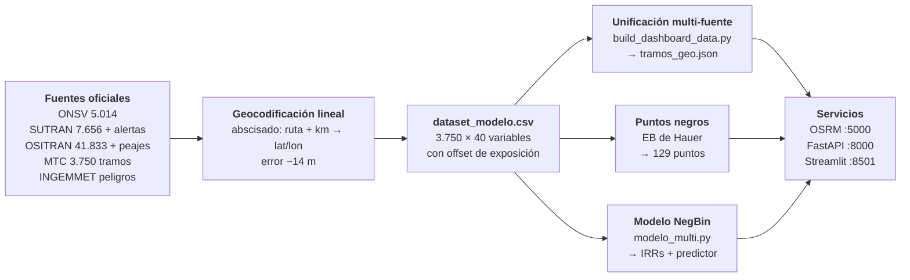

  
Bloque 03 · Pipeline analítico esencial

  <h2>De «PE-1S km 45» a un mapa</h2>
  

    El paso que lo cambia todo: <b>abscisado sobre el polilíneo</b>.
    Cada accidente se proyecta sobre la red del MTC usando el kilómetro declarado, sin depender de un geocoder externo.
  

  03

---

  

    Pipeline esencial
    <h1>El pipeline completo, de las fuentes a los servicios</h1>
  

  

    3 fuentes → geocodificación → dataset 
    →NegBin + puntos negros → 3 servicios
  

---

  

    Pipeline esencial
    <h1>Geocodificación lineal: el abscisado por kilómetro</h1>
  

  

    <code>scripts/geocode.py</code> 
    Error típico <b>~14 m</b>
  

  

    

      
1 · El dato de partida

      
El registro dice <code>ruta: PE-1S</code> · <code>km: 45</code> · <code>fecha</code> · <code>causa</code>. 
      <b>Sin coordenadas.</b> Es la forma en que reportan las tres fuentes.

    

    

      
2 · El polilíneo

      
Se busca la <b>carretera</b> en la red MTC y se toma su <code>LineString</code> completo,
      recorrido de extremo a extremo con su progresiva acumulada.

    

    

      
3 · La proyección

      
Se interpola el km sobre la distancia acumulada y se devuelve el punto
      (<code>locate()</code> en <code>geocode.py</code>). Verificado contra CGM.

    

  

  

    

      <KpiCard :value="14" suffix=" m" label="Error de geocodificación" hint="Verificado contra CGM" tone="green" />
      <KpiCard :value="99.4" :decimals="1" suffix="%" label="Cobertura SUTRAN" hint="Registros con punto válido" tone="green" />
    

    <ul class="sipat-list sipat-list--sm">
      <li><b>Determinista</b>: el mismo km produce siempre la misma coordenada</li>
      <li><b>Sin dependencia externa</b>: no hace falta llamar a un geocoder de pago</li>
      <li>Reutilizable para OSITRAN, que reporta por <b>tramo de concesión</b> (se asigna al centroide)</li>
    </ul>
    

      Esta decisión es la que hace posible todo lo demás: sin coordenada no hay <b>cKDTree</b>,
      ni buffer de 2 km, ni perfil de riesgo, ni nada de lo que sigue.
    

  

---

  

    Pipeline esencial
    <h1>El dataset espacial: 3.750 tramos × 40 variables</h1>
  

  

    <code>data/processed/dataset_modelo.csv</code> 
    La tabla que alimenta el modelo
  

  

    
Exposición

    
longitud del tramo, <code>expo_km</code> y catalogos de la fuente dominante

  

  

    
Siniestros

    
conteo por fuente (ONSV / SUTRAN / OSITRAN), <b>fallecidos</b>, lesionados, <code>fuente_dominante</code>

  

  

    
Geometría vial

    
topografía, superficie, <b>velocidad proyectada</b>, carriles, <b>sinuosidad</b>, <code>es_panamericana</code>

  

  

    
Entorno de riesgo

    
distancia a peligros <b>INGEMMET</b>, a peajes, a cinemómetros, densidad <code>c10km</code>

  

<table class="sipat-table" style="margin-top:13px">
  <thead><tr><th style="width:20%">Grupo</th><th style="width:34%">Variables representativas</th><th>Para qué entra en el modelo</th></tr></thead>
  <tbody>
    <tr><td><b>Respuesta</b></td><td><code>n_siniestros</code>, <code>fallecidos</code>, <code>lesionados</code></td><td>La variable que el NegBin intenta explicar</td></tr>
    <tr><td><b>Exposición</b></td><td><code>expo_km</code>, longitud del tramo</td><td>Entra como <b>offset</b>: normaliza por los kilómetros expuestos</td></tr>
    <tr><td><b>Vía</b></td><td><code>vel_proy</code>, <code>carriles</code>, <code>sup_buena</code>, <code>sinuosidad</code></td><td>Capacidad real de la vía y su geometría</td></tr>
    <tr><td><b>Entorno</b></td><td><code>log_ingemmet</code>, <code>log_peajes</code>, <code>log_cine</code>, <code>cinemometros_c10km</code></td><td>Transformadas logarítmicas porque la influencia es de orden multiplicativo</td></tr>
    <tr><td><b>Contexto</b></td><td><code>es_panamericana</code>, dummies de región y topografía</td><td>Controlan diferencias no viales entre zonas, para no atribuirlas a la vía</td></tr>
  </tbody>
</table>

  <b>Por qué el offset importa:</b> sin él, un tramo de 40 km parecería <b>más seguro</b> que uno de
  5 km solo por tener menos kms expuestos. El offset obliga a que el modelo compare
  <b>siniestros por kilómetro</b>, que es la magnitud que se quiere predecir.

---

  

    Pipeline esencial
    <h1>Puntos negros: 12 en Fase 1, 129 en la versión multi-fuente</h1>
  

  

    <code>build_puntos_negros.py</code> 
    Tres criterios, todos a la vez
  

  <figure class="sipat-fig">
    
    <figcaption>Puntos negros detectados por exceso Empirical Bayes (método de Hauer)</figcaption>
  </figure>
  

    
<b>Ventana deslizante de 1 km</b> + tres criterios simultáneos:

    <v-clicks>
      

        
1 · Percentil 95 regional

        
Supera el percentil 95 de su región: descarta ruido estadístico.

      

      

        
2 · Exceso Empirical Bayes &gt; 1.0

        
Método de Hauer: corrige por <b>exposición y varianza</b> de cada tramo.

      

      

        
3 · Residuos del modelo &gt; 2.0

        
El tramo es peor de lo que el NegBin predice: el modelo no lo explica.

      

      

        Cada punto lleva su <code>fuente_dominante</code>: qué fuente concentra el exceso.
      

    </v-clicks>
  

  

    <b>12</b> = detector de <b>Fase 1</b>, solo ONSV → <code>data/processed/puntos_negros.csv</code>
  

  

    <b>129</b> = detector <b>multi-fuente</b> (ONSV+SUTRAN+OSITRAN) → <code>dashboard/puntos_negros.json</code>
  

