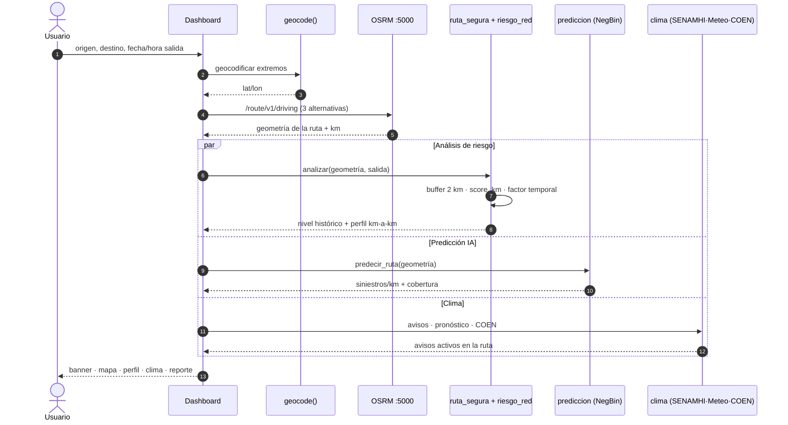

  
Bloque 05 · Producto principal esencial

  <h2>🧭 Viaja seguro</h2>
  

    «Preventión antes de viajar». El usuario entra origen, destino y <b>hora de salida</b>;
    el sistema responde con el riesgo de esa ruta <b>para ese momento concreto</b>.
  

  05

---

  

    Viaja seguro esencial
    <h1>El flujo completo, paso a paso</h1>
  

  

    3 capas en <b>paralelo</b>: 
    riesgo · predicción · clima
  

---

  

    Viaja seguro esencial
    <h1>Lo que ve el usuario al analizar su ruta</h1>
  

  

    Pestaña principal del dashboard 
    <code>dashboard/viaja_seguro.py</code>
  

  

    
💊 Pills de rutas populares

    
Lima → Huancayo, Lima → Cusco, Trujillo → Chiclayo… un clic y la ruta se calcula.

  

  

    
📊 Cards KPI

    
Distancia · riesgo histórico · riesgo IA · <b>ruta más segura</b> · accidentes en la ruta

  

  

    
🚦 Banner semáforo

    
Nivel global de riesgo con el color temático — la lectura en 1 segundo.

  

  

    
🗺️ Mapa full-width

    
Cada accidente <b>clicable</b>: fecha, tipo, causa, gravedad, clima, superficie.

  

  

    
📈 Perfil km a km

    
Segmentos de 5 km con su score: dónde empeora la ruta y por qué.

  

  

    
❓ ¿Qué puede pasar?

    
Top-5 tipos de incidente, top-5 causas y clima histórico en esa ruta.

  

  

    
⛅ Clima y emergencias

    
Pronóstico Open-Meteo, avisos SENAMHI, emergencias COEN. Botón de refresco manual.

  

  

    
📄 Reporte HTML

    
Autocontenido y descargable: mapa, perfil, clima y tipos de incidente.

  

  <b>Ranking de las 3 alternativas:</b> OSRM devuelve hasta 3 rutas y el motor las ordena por
  <b>corta</b>, <b>rápida</b> y <b>segura</b>. La «segura» es la que minimiza el score penalizado
  por alertas en vivo — no la más corta, necesariamente.

---

  

    Viaja seguro esencial
    <h1>Las tres capas de contexto en vivo</h1>
  

  

    Cachés con TTL 
    El dashboard nunca se rompe
  

  

    
⛅ Open-Meteo ~2 h

    
Temperatura, lluvia y viento <b>muestreados sobre la geometría</b> de la ruta (hasta 4 puntos).
    Pronóstico a 3 días. Sin API key.

  

  

    
🌧️ SENAMHI ~3 h

    
WFS oficial <code>g_prono_pp_24h</code>: avisos a 24 h con nivel, fecha y recomendación.
    Se cruzan contra el buffer de la ruta.

  

  

    
🆘 COEN-INDECI ~6 h

    
Emergencias activas (incendios, inundaciones, <b>sismos</b>) de los últimos 7 días,
    geocodificadas y filtradas por proximidad a la ruta.

  

  

    
🚧 SUTRAN 15 min

    
Alertas de tránsito en vivo. Cada consulta <b>alimenta el histórico</b>:
    donde se repite la alerta, sube el score estructural del tramo.

  

  

    <b>Acumulación:</b> <code>sutran_alertas_historico.json</code> no se sobrescribe nunca.
    Es la memoria del sistema sobre <b>zonas de incidentes recurrentes</b>.
  

  

    <b>Degradación limpia:</b> si SENAMHI, Open-Meteo o COEN fallan, el dashboard muestra
    «no disponible» en esa sección. El análisis de riesgo <b>no se interrumpe</b>.
  

