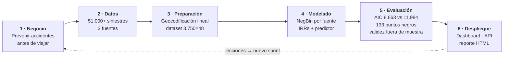
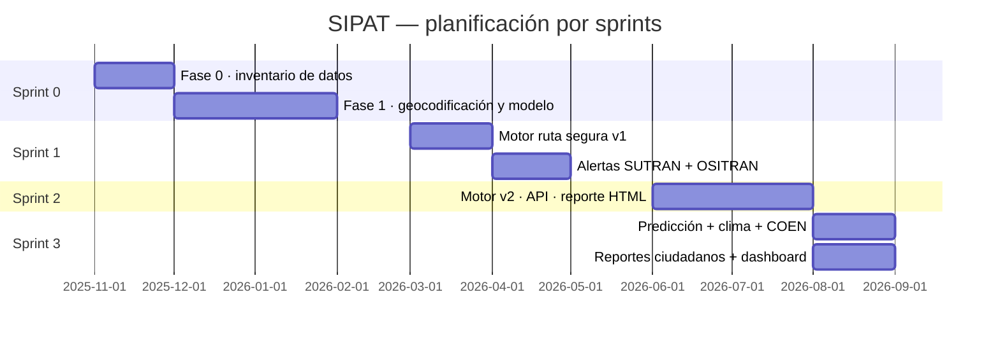

  
Bloque 08 · Metodología esencial

  <h2>Dos marcos complementarios</h2>
  

    <b>CRISP-DM</b> ordena el <i>ciclo de datos</i>: qué se hace con los datos y cuándo.
    <b>SCRUM</b> organiza la <i>entrega de producto</i>: qué se entrega en cada sprint y cómo se verifica.
  

  08

---

  

    Metodología esencial
    <h1>CRISP-DM: las 6 fases y qué se hizo en cada una</h1>
  

  

    El ciclo se cierra: 
    las lecciones vuelven a empezar
  

<table class="sipat-table" style="margin-top:13px;font-size:.76rem">
  <thead><tr><th style="width:19%">Fase</th><th>Qué se hizo en SIPAT</th></tr></thead>
  <tbody>
    <tr><td><b>1 · Negocio</b></td><td>Dos productos: índice de riesgo por ruta y reporte ciudadano. Usuarios: viajeros e instituciones</td></tr>
    <tr><td><b>2 · Datos</b></td><td>Inventario de 3 fuentes de siniestros + red vial MTC + peligros INGEMMET. Calidad: geocodificación lineal (~14 m), cobertura SUTRAN 99.4 %</td></tr>
    <tr><td><b>3 · Preparación</b></td><td>Limpieza (nulos, duplicados, rutas PE-XX), unificación multi-fuente por tramo, features espaciales con buffer 2 km y cKDTree, tráfico de peajes</td></tr>
    <tr><td><b>4 · Modelado</b></td><td>Negative Binomial por fuente con offset de exposición; predictor que empalma la ruta del usuario a los tramos</td></tr>
    <tr><td><b>5 · Evaluación</b></td><td>AIC NegBin 8.663 vs Poisson 11.984; validación con AppTest + 30 checks; contraste con los umbrales de riesgo</td></tr>
    <tr><td><b>6 · Despliegue</b></td><td>Dashboard de 7 pestañas, API REST, reporte HTML autocontenido, datos ligeros en <code>data/processed/dashboard/</code></td></tr>
  </tbody>
</table>

---

  

    Metodología esencial
    <h1>SCRUM: 3 sprints, cada uno con entrega verificada</h1>
  

  

    Un sprint que no verifica 
    no está terminado
  

  

    
Definición de «hecho»

    
Ningún sprint se cierra sin su <b>batería de 30 comprobaciones</b> y el
    <b>AppTest headless</b> del dashboard (7 pestañas + «Analizar mi ruta» sin excepciones).

  

  

    
Documentación como entregable

    
Los <b>4 diagramas Archify</b> se actualizan al final de cada sprint:
    documentan el sistema <b>en su estado real</b>, no en el previsto.

  

  

    
Kanban en el ETL

    
Tablero implícito por etapas del pipeline: cada cambio de dataset pasa por
    <code>clean → transform → data_quality → gate → publish</code>.

  

