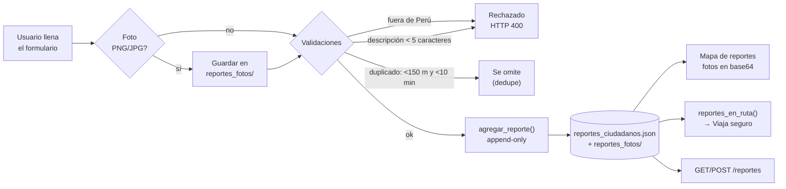

  
Bloque 09 · Cierre esencial

  <h2>Verificación, límites y qué viene después</h2>
  

    Un sistema que se automide puede mentir sobre sí mismo. Por eso SIPAT publica sus
    <b>30 comprobaciones</b> —incluidas las que fallarían— y sus limitaciones con el mismo peso
    que sus logros.
  

  09

---

  

    Verificación esencial
    <h1>30 de 30 comprobaciones en verde</h1>
  

  

    <code>scripts/verificar_proyecto.py</code> 
    Resultado en <code>dashboard/verificacion.json</code>
  

  <KpiCard :value="30" suffix="/30" label="Checks en verde" hint="all_required_ok: true" tone="green" />
  <KpiCard :value="3" label="Servicios UP" hint="OSRM :5000 · API :8000 · Streamlit :8501" tone="green" />
  <KpiCard :value="7" label="Pestañas probadas" hint="AppTest headless, 0 excepciones" tone="green" />
  <KpiCard :value="2" label="Reportes HTML" hint="Lima→Huancayo 850 KB · Trujillo→Chiclayo 498 KB" tone="indigo" />

<table class="sipat-table sipat-table--tight">
  <thead><tr><th style="width:24%">Familia</th><th style="width:8%" class="num">Checks</th><th>Detalle verificado</th></tr></thead>
  <tbody>
    <tr><td><b>Datasets y documentos</b></td><td class="num">10</td>
      <td><code>tramos_red.csv</code> 639 KB · <code>onsv_nacional_geocod.csv</code> 1.687 KB · <code>sutran_accidentes_geocod.csv</code> 944 KB ·
      <code>dataset_modelo.csv</code> 1.386 KB · <code>ositran_*</code> · informe, matriz técnica, manual, figuras</td></tr>
    <tr><td><b>Servicios</b></td><td class="num">3</td>
      <td>OSRM <code>:5000</code> UP · API <code>:8000</code> UP · Streamlit <code>:8501</code> UP</td></tr>
    <tr><td><b>Endpoints API</b></td><td class="num">4</td>
      <td><code>/health</code> HTTP 200 · <b>18.807 puntos</b> · <code>/alertas</code> 2 alertas ·
      <code>/avisos</code> OK · <code>POST /ruta_segura_completa</code> <b>hist=8.5726 [Alto] pred=0.6733 [Medio] cov=41.6 %</b></td></tr>
    <tr><td><b>Interfaz</b></td><td class="num">1</td>
      <td>AppTest: <code>7 tabs + Analizar mi ruta → 0 excepciones</code></td></tr>
    <tr><td><b>Exportaciones</b></td><td class="num">4</td>
      <td>JSON de Lima→Huancayo (667 KB) y Trujillo→Chiclayo (299 KB), más sus CSV</td></tr>
    <tr><td><b>Reportes</b></td><td class="num">2</td>
      <td>Reporte HTML autocontenido de ambas rutas</td></tr>
    <tr><td><b>Grafo de conocimiento</b></td><td class="num">2</td>
      <td><code>graph.json</code> regenerado (456 nodos) · vault Obsidian con 392 notas</td></tr>
  </tbody>
</table>

---

  

    Verificación esencial
    <h1>📣 El otro producto: el reporte ciudadano</h1>
  

  

    Almacenamiento <b>append-only</b> 
    Sin moderación aún
  

  

    
🔐 Validaciones que sí importan

    
Coordenadas dentro de Perú · descripción mínima · deduplicación
    <b>temporal y espacial</b> (150 m / 10 min) · tipos y severidades acotados a un catálogo.

  

  

    
⚖️ El límite explícito

    
Son datos <b>autodeclarados y sin moderación</b>. Sirven como señal
    complementaria y reciente, <b>nunca como dato oficial</b>, y el sistema los mantiene
    separados de las tres fuentes institucionales.

  

---

  

    Limitaciones esencial
    <h1>Lo que el sistema NO hace</h1>
  

  

    Limitaciones declaradas, 
    no descubiertas por el usuario
  

  

    
Tres fuentes, tres realidades

    
ONSV tiene calidad variable por departamento; SUTRAN solo cubre 2020-2021;
    OSITRAN solo cubre concesiones y sin coordenadas exactas (se asigna al centroide del tramo).
    <b>El sistema nunca mezcla cifras como si fueran homogéneas</b>: todo análisis permite separar por fuente.

  

  

    
El riesgo histórico no es una predicción

    
Es exposición pasada. Por eso existe la <b>segunda capa</b> (NegBin), que
    ajusta por longitud, tráfico y características viales. Mostrar los dos indicadores juntos es la
    decisión de honestidad más importante del diseño.

  

  

    
Cobertura predictiva ≈ 42 %

    
Casi 6 de cada 10 km de una ruta no tienen features completas.
    <b>El sistema lo muestra en pantalla en vez de rellenar el hueco</b>.

  

  

    
Dependencia de servicios externos

    
SENAMHI, Open-Meteo y COEN pueden caerse. El dashboard muestra «no disponible»
    en esa sección <b>sin romper el análisis de riesgo</b>.

  

---

  

    Riesgos técnicos esencial
    <h1>Un riesgo que encontró esta misma verificación</h1>
  

  

    Depósito de los problemas, 
    no herencia
  

  <b>El grafo de conocimiento está roto.</b> <code>graphify-out/graph.json</code> contiene
  <b>456 nodos pero 0 aristas</b>: un <i>update</i> incremental colapsó todas las relaciones.
  El <code>GRAPH_REPORT.md</code> que cita 675 aristas <b>ya no describe el fichero real</b>.

  

    

      
Impacto

      
Las consultas de grafo (<code>graphify query</code>, <code>path</code>, <code>explain</code>)
      devuelven subgrafos vacíos. <b>No afecta al sistema</b>: ni el dashboard, ni la API, ni el ETL leen el grafo.
      Solo afecta a la navegación y documentación asistida.

    

  

  

    

      
Por qué se documenta aquí

      
Porque la verificación debería <b>haberlo detectado y no lo hizo</b>:
      el check <code>graph:graph_json</code> valida que el fichero exista y tenga nodos, <b>no que tenga aristas</b>.
      La corrección es doble: rebuild del grafo <b>y</b> un check que verifique <code>edges &gt; 0</code>.

    

  

  <b>Regla que se sigue aplicando:</b> esta presentación se construyó leyendo los README y el código,
  <b>no</b> el grafo de conocimiento. La fuente autoritativa es el código.

---

  

    Cierre esencial
    <h1>Qué viene después</h1>
  

  

    Priorizado por coste / impacto
  

  

    
1 · Reparar el grafo de conocimiento

    
Rebuild completo y añadir el check <code>edges &gt; 0</code> a la batería.
    <b>Coste bajo, riesgo cero</b>, devuelve la navegación por el código.

  

  

    
2 · Subir la cobertura predictiva

    
Completar las features que faltan en el 58 % de la red para que la
    predicción cubra más que el 42 % actual.

  

  

    
3 · Moderación de reportes

    
El módulo ciudadano es el único punto sin control de calidad.
    Un flujo de validación o descarte convertiría la crowdsource en señal fiable.

  

  

    
4 · Versionado de datos

    
El ETL documenta ya la migración a <b>DVC</b> y a <b>Airflow</b>
    (<code>etl-project/docs/</code>). Llevar el datasets a DVC daría trazabilidad por versión.

  

  <b>Y una más, de producto:</b> el <code>MODEL_READY</code> del ETL ya está implementado y
  <code>src/ml/</code> tiene el esqueleto de MLflow. El salto de «riesgo por ruta» a
  «predicción de tasa por tramo con modelo registrado» es el siguiente paso natural.

---

  

    Recursos esencial
    <h1>Dónde está todo</h1>
  

  

    

      
📦 Código

      

        <b>github.com/Lobitoxxx/SIPAT</b> (rama <code>main</code>) 
        <code>etl-project/</code> es un <b>repo Git independiente</b> 
        Se excluye <code>data/raw/</code> (OSM 2.5 GB), las cachés y los reportes ciudadanos por privacidad.
      

    

    

      
📄 Documentación

      

        <code>docs/informe_sipat.md</code> informe técnico 
        <code>docs/matriz_tecnica.md</code> decisiones por componente 
        <code>docs/modulo_ruta_segura.md</code> manual del motor 
        <code>docs/archify/</code> 4 diagramas interactivos
      

    

  

  

    

      
📚 Documentación del ETL

      

        <code>etl-project/docs/informe_etl_v1.md</code> informe + 10 defectos 
        <code>guia_sustentacion.md</code> qué preguntar y qué responder 
        <code>preguntas_tecnicas.md</code> 12 preguntas con referencia a código 
        <code>airflow_migracion.md</code> · <code>dvc_versionado.md</code> · <code>mlflow_modelado.md</code>
      

    

    

      
▶️ Arrancar el sistema

      

        <code>python scripts/download_osm.py</code> 
        <code>python scripts/osrm_build.py</code> 
        <code>python scripts/boot_services.py</code> 
        <code>python scripts/verificar_proyecto.py</code>
      

    

  

---

  
🛡️

  <h1>Gracias</h1>
  

    51.000+ siniestros reales · 3 fuentes oficiales · 2 subsistemas ·
    <b>30/30 verificaciones en verde</b>
  

  

    La idea en una frase: <b>el riesgo histórico no es una predicción</b>,
    y un sistema que lo dice en voz alta vale más que uno que no lo dice.
  

  

    <a href="https://github.com/Lobitoxxx/SIPAT" target="_blank">github.com/Lobitoxxx/SIPAT</a>
    <a href="/gif/hero-arquitectura.gif" target="_blank">GIF arquitectura</a>
  

